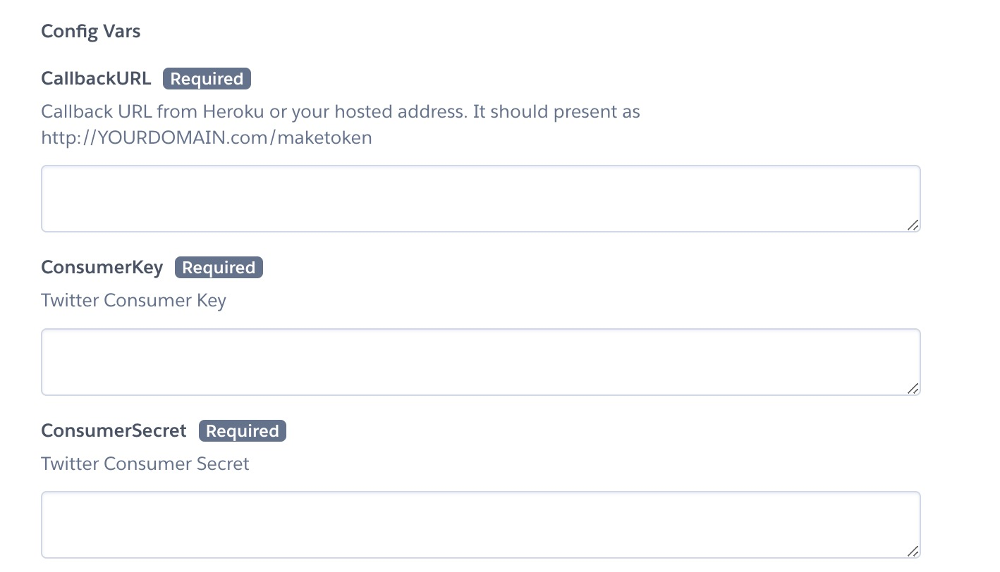
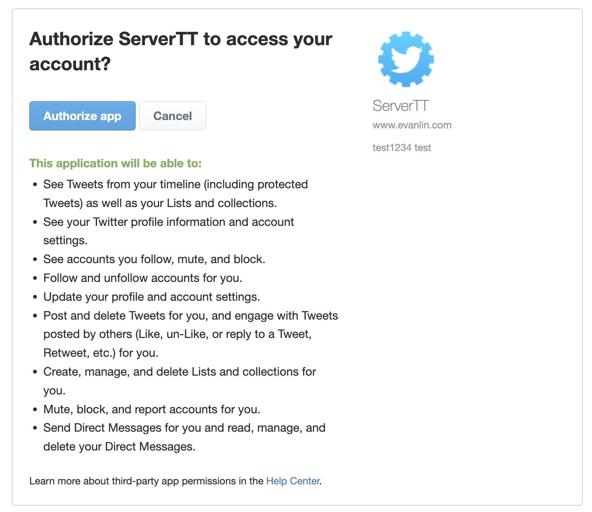

Twitter Auth Website
==============

  |  | 

Installation and Usage
=============

### Apply your Twitter Dev App 

[Apply Twitter App](https://developer.twitter.com/en/apps)

### Just Deploy this on Heroku

You need to input three parameter for Heroku.

1. CallbackURL: From Heroku, after you design your app name (e.g. example), so it would be "<https://example.herokuapp.com/maketoken>".
2. ConsumerKey from [Twitter Developer](https://developer.twitter.com/en/apps), request and create a app for it on <https://developer.twitter.com/en/apps>.
3. ConsumerSecret from [Twitter Developer](https://developer.twitter.com/en/apps), request and create a app for it on <https://developer.twitter.com/en/apps>.
4. Deploy it
5. Go your address (e.g. <https://example.herokuapp.com/>)
6. Click the twitter image to authorize.

7. After authorized, it will show your latest tweet from your timeline.

License
---------------

Licensed under the Apache License, Version 2.0 (the "License");
you may not use this file except in compliance with the License.
You may obtain a copy of the License at

<http://www.apache.org/licenses/LICENSE-2.0>

Unless required by applicable law or agreed to in writing, software
distributed under the License is distributed on an "AS IS" BASIS,
WITHOUT WARRANTIES OR CONDITIONS OF ANY KIND, either express or implied.
See the License for the specific language governing permissions and
limitations under the License.
